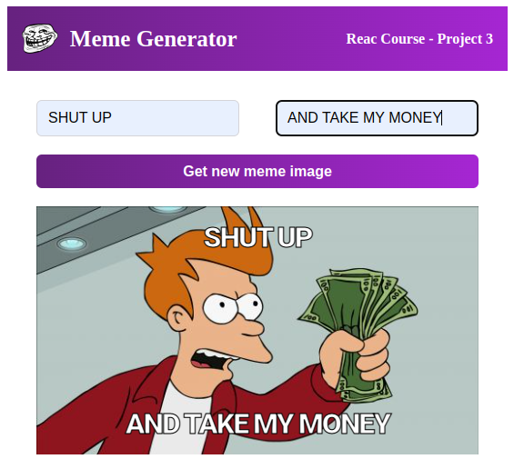

# Meme Generator

This project is part of a Scrimba course on React development.

The app make a fetch request to the [get memes api from imagflip](https://imgflip.com/api) and display a random image. 

We can then type the top and bottom text into the image.

## Objective

Learn how to use states and fetch data inside function component with useState and useEffect hooks. 

## Screenshot

This project was bootstrapped with [Create React App](https://github.com/facebook/create-react-app).